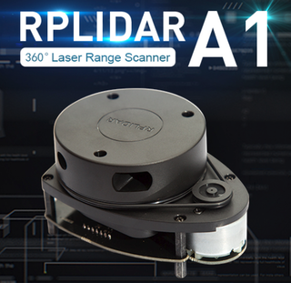
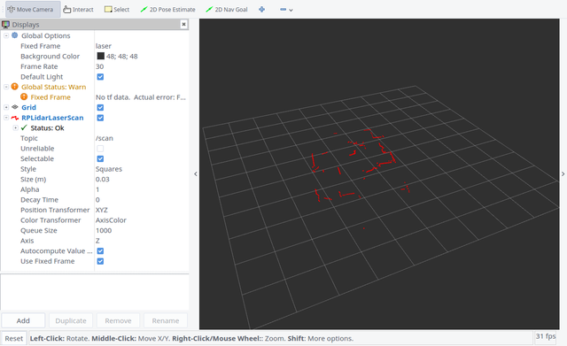
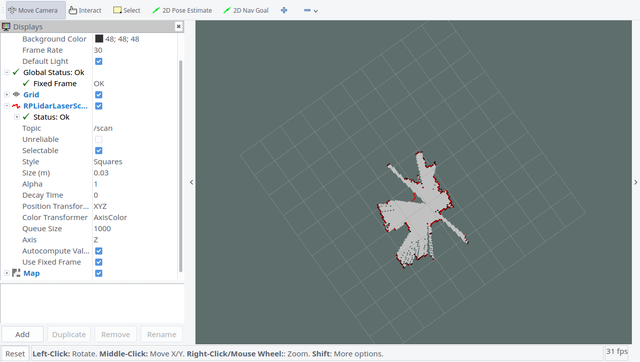
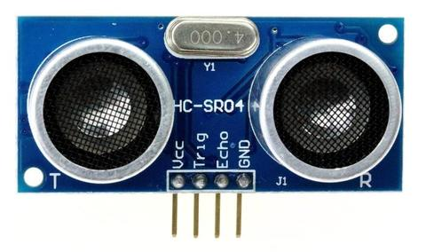

# 1. Cameras

* [Sensors/Cameras (ROS Wiki)](http://wiki.ros.org/Sensors/Cameras)
* [Set up a Webcam with Linux](http://www.linuxintro.org/wiki/Set_up_a_Webcam_with_Linux)
* [Accessing the Video Device](https://www.tldp.org/HOWTO/Webcam-HOWTO/dev-intro.html)
* v4l2-ctl
* viewer: [GTK+ UVC Viewer](http://guvcview.sourceforge.net/index.html)

Create Video Device(/dev/video1):   
```
sudo mknod /dev/video1 c 81 1
sudo chmod 666 /dev/video1
sudo chgrp video /dev/video1
```

## Types

### Orbbec Astra Camera
* [astra_camera (ROS Wiki)](http://wiki.ros.org/astra_camera)
* [ROS wrapper for Astra camera](https://github.com/orbbec/ros_astra_camera)

### Realsense Camera
* [realsense_camera (ROS Wiki)](http://wiki.ros.org/realsense_camera)
* [Realsense概览](https://blog.csdn.net/app_12062011/article/details/52662143)


## Calibration

* [camera_calibration (ROS Wiki)](http://wiki.ros.org/camera_calibration)
* [Tutorial Camera Calibration](http://boofcv.org/index.php?title=Tutorial_Camera_Calibration)
* [Camera Calibration Toolbox for Matlab](http://www.vision.caltech.edu/bouguetj/calib_doc/)
* [CamOdoCal: Automatic Intrinsic and Extrinsic Calibration of a Rig with Multiple Generic Cameras and Odometry](https://github.com/hengli/camodocal)

### OpenCV
* [Camera calibration With OpenCV](http://docs.opencv.org/2.4/doc/tutorials/calib3d/camera_calibration/camera_calibration.html)
* [Interactive camera calibration application](http://docs.opencv.org/3.2.0/d7/d21/tutorial_interactive_calibration.html)
* [Camera calibration using C++ and OpenCV](http://sourishghosh.com/2016/camera-calibration-cpp-opencv/)
* [Stereo calibration using C++ and OpenCV](http://sourishghosh.com/2016/stereo-calibration-cpp-opencv/)
* [Stereo Calibration](http://www.jayrambhia.com/blog/stereo-calibration)
* [张氏法相机标定](https://zhuanlan.zhihu.com/p/24651968)
* [Camera Calibration in SVO](https://github.com/uzh-rpg/rpg_svo/wiki/Camera-Calibration)
* [Calibrate fisheye lens using OpenCV](https://medium.com/@kennethjiang/calibrate-fisheye-lens-using-opencv-333b05afa0b0)
* [OpenCV C++ Stereo Fisheye Calibration](https://github.com/sourishg/fisheye-stereo-calibration)

Stereo Camera Calibration in ROS:
```
#!/usr/bin/env bash
rosrun camera_calibration cameracalibrator.py --approximate=0.1 --size 11x8 --square 30 \
right:=/stereo/right/image_raw left:=/stereo/left/image_raw
```

## Rectification
* [Stereo Fisheye Rectification](https://github.com/ShreyasSkandanS/stereo_fisheye_rectify)


-----

# 2. IMU

## IMU Tools
* **IMU Pose Calculation**
  - [ccny-ros-pkg/imu_tools](https://github.com/ccny-ros-pkg/imu_tools): ROS tools for IMU devices

* **IMU Performance Analysis**
  - [IMU-TK](https://bitbucket.org/alberto_pretto/imu_tk): Inertial Measurement Unit ToolKit
  - [gaowenliang/imu_utils](https://github.com/gaowenliang/imu_utils): A ROS package tool to analyze the IMU performance
  - [rpng/kalibr_allan](https://github.com/rpng/kalibr_allan): IMU Allan standard deviation charts for use with Kalibr and inertial kalman filters
  - [AllanTools](https://pypi.org/project/AllanTools/): A python library for calculating Allan deviation and related time & frequency statistics.


-----

# 3. LiDAR



* [rplidar (ROS Wiki)](http://wiki.ros.org/rplidar)
* [RPLIDAR A1 (slamtec)](http://www.slamtec.com/en/lidar/a1)
* [在自动驾驶中，单线激光雷达能干什么?](https://www.leiphone.com/news/201612/kEUZbebrEA2WJRVE.html)

## Launch

* 运行 `roslaunch rplidar_ros view_rplidar.launch`，效果如下


* 通过 **hector_slam** 建图，运行 `roslaunch rplidar_ros view_slam.launch`，效果如下



-----

# 4. UltraSonic




-----

# 5. Calibration

## Kalibr

[Kalibr](https://github.com/ethz-asl/kalibr) is a toolbox that solves the following calibration problems:  

* Multiple camera calibration
* Camera-IMU calibration
* Rolling Shutter Camera calibration

## CamOdoCal
[CamOdoCal](https://github.com/hengli/camodocal): Automatic Intrinsic and Extrinsic Calibration of a Rig with Multiple Generic Cameras and Odometry.  

This C++ library supports the following tasks:
1. Intrinsic calibration of a generic camera.  
2. Extrinsic self-calibration of a multi-camera rig for which odometry data is provided.  
3. Extrinsic infrastructure-based calibration of a multi-camera rig for which a map generated from task  2 is provided.
