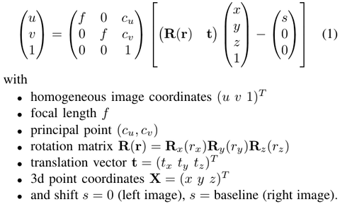



# Overview
**[LIBVISO2 (Library for Visual Odometry 2)](http://www.cvlibs.net/software/libviso/)** is a very fast cross-platfrom (Linux, Windows) C++ library with MATLAB wrappers for computing the 6 DOF motion of **a moving mono/stereo camera**.

* The ***stereo version*** is based on **minimizing the reprojection error of sparse feature matches** and is rather general (no motion model or setup restrictions except that the input images must be rectified and calibration parameters are known).

* The ***monocular version*** is still very experimental and **uses the 8-point algorithm for fundamental matrix estimation**. It further assumes that the camera is moving at a known and fixed height over ground (for estimating the scale). Due to the 8 correspondences needed for the 8-point algorithm, many more **RANSAC samples** need to be drawn, which makes the monocular algorithm slower than the stereo algorithm, for which 3 correspondences are sufficent to estimate parameters.

## Paper & Code
* papers: ***StereoScan: Dense 3D Reconstruction in Real-time***
* Code: [GaoHongchen/viso2_kinetic_cg](https://github.com/GaoHongchen/viso2_kinetic_cg)

## Scen Flow
<!-- <figure>
	
	<figcaption>ScenFlow</figcaption>
</figure> -->

# Feature Matching

## Feature Detection

**Blob/Corner Detector:**

* filter the input images with **5×5 blob and corner masks**  
* employ **non-maximum- and non-minimum-suppression** on the filtered images, resulting in feature candidates

**Feature Descriptor:**  

The descriptor concatenates **Sobel filter** responses using the layout given in below:

simply compare 11 × 11 block windows of horizontal and vertical Sobel filter responses to each other by using **the sum of absolute differences (SAD) error metric**; to speed-up matching, we quantize the **Sobel responses** to **8 bits** and sum the differences over a sparse set of **16 locations** instead of summing over the whole block window; since **the SAD of 16 bytes** can be computed efficiently using a single **SSE instruction** we only need two calls (for horizontal + vertical Sobel responses) in order to evaluate this error metric

* 16 locations within 11 × 11 block window
* 32 bytes per descriptor
* Efficient Sum-of-Absolute-Differences (SAD) via SIMD

## Circle Match

Starting from all feature candidates in **the current left image**, we find the best match in **the previous left image** within a **M × M search window**, next in **the previous right image**, **the current right image** and last in **the current left image** again.

A **’circle match’** gets accepted, if the last feature coincides with the first feature.

* Detect interest points using non-maximum-suppression
* Match 4 images in a ’space-time’ circle
* make use of **the epipolar constraint** using an error tolerance of **1 pixel** when **matching between the left and right images**
* Accept if last feature coincides with first feature

**Fast feature matching:**  
* 1st: Match a sparse set of interest points within each class
* Build statistics over likely displacements within each bin
* Use this statistics for speeding up 2nd matching stage
* Rejection outliers (Delaunay triangulation)

# Egomotion Estimation

## Projection Model

Assuming squared pixels and zero skew, **the reprojection** into the current image is given by

## Minimize reprojection errors(GN & RANSAC)

reprojection errors:  
$$
\begin{aligned}
r(\beta)
=&
(r_0, r_1, r_2, \cdots, r_{11}) \\
=&
\sum_{i=1}^N
{\| x_i^{(l)} - \pi^{(l)}(X_i; R,t) \|}^2 +
{\| x_i^{(r)} - \pi^{(r)}(X_i; R,t) \|}^2 \\
=&
\sum_{i=1}^3
(u_i^l-u^l)^2 + (v_i^l-v^l)^2 + (u_i^r-u^r)^2 + (v_i^r-v^r)^2
\end{aligned}
$$

Optimization parameters vector:  
$$
\beta = (r_x, r_y, r_z, t_x, t_y, t_z)
$$

Jocobians Matrix:  
$$
J_{12 \times 6} = \frac{\partial{r(\beta)}}{\partial{\beta}}
$$

Parameter iteration:  
$$
\beta_i = \beta_{i-1} - (J^TJ)^{-1} \cdot J^T r(\beta_{i-1})
$$

## Kalman Filter (constant acceleration model)

# Stereo Matching
Stereo matching stage takes the output of the feature matching stage and builds a disparity
map for each frame. In this paper, the disparity map is built with a free library called **ELAS**.
**ELAS is a novel approach to binocular stereo for fast matching of high resolution imagery.**

# 3D Reconstruction
The simplest method to **point-based 3d reconstructions** map all valid pixels to 3d and projects
them into a common coordinate system using the egomotion matrix.
